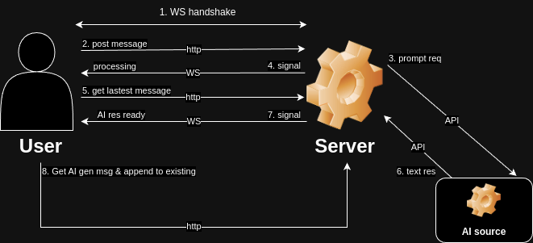

# Angular, NestJs assignment project

## Prerequisites

* **Node.js:** Ensure Node.js is installed on your system.
You can download it from Node.js Official Website.

* **Ports:** Ensure that ports 3000 (for the backend) and 4200 (for the Angular frontend) are open and available for use.

## Setup instructions

### 1. Install npm packages:

 You need to install the necessary npm packages in both the backend and frontend:

* **Backend:** navigate to backend folder and in your terminal execute the `npm install` command.

* **Frontend:** navigate to frontend folder and in your terminal execute the `npm install` command.

### 2. Run the Applications:

After installing the dependencies, navigate to the respective directories and start the applications:

* **Backend:** navigate to backend folder and in your terminal execute the `npm start` command.
* **Frontend:** navigate to frontend folder and in your terminal execute the `npm start` command.

This will get both the backend and frontend running on their respective ports (3000 for backend and 4200 for frontend).

### 3. API Documentation Generation:

After starting the backend, the API documentation will be autogenerated in the `docs/openapi.yaml file`, providing a detailed specification of the server’s API.

### 3. (Optional - when needed )Generate API Services for Frontend:

If the app/api folder does not exist in the frontend, you can generate the API services by running the following command in your frontend root folder: `npm run codegen`. 
This command leverages the `openapi.yaml` file to generate API services for the frontend, ensuring seamless integration with the backend APIs.

## Flow: WebSocket and HTTP Flow for AI Response System

### Why This Approach?
This hybrid approach leverages WebSocket for real-time status updates and HTTP for reliable data transfer. It balances performance, reliability, and scalability, ensuring efficient handling of tasks that involve processing delays, like AI response generation (1-3 seconds). It is optimal for systems requiring real-time feedback without compromising data integrity.

### Overview:
1. **WebSocket (WS) Handshake:**
* Establishes a persistent connection between the client and server for real-time communication.

2. **Prompt AI (API Call):**
* User sends a message to the server via an HTTP POST request.
* Reliable for transmitting data, particularly large or sensitive content.

3. **Send User Message (HTTP):**
* Server sends a request to the AI source to generate a response based on the user's input.
* Asynchronous operation that may take up to 3 or more seconds.

4. **Processing Signal (WS):**
* Server sends a signal to the client via WebSocket to notify that the message is being processed.
* Real-time feedback to keep the UI responsive.

5. **Client Fetches Latest Message (HTTP):**
* Client can make an HTTP request to check for any updates in the message history.
* Ensures reliable and complete data retrieval.

6. **Receive AI Response (API Call):**
* Server receives the generated AI response from the AI source.

7. **AI Response Ready Signal (WS):**
* Server sends another WebSocket signal to notify the client that the AI response is ready.

8. **Fetch AI-Generated Message (HTTP):**
* Client makes an HTTP request to fetch the AI response.
* Ensures the response is delivered reliably and appended to the existing conversation.

### Key Benifits:

* **Real-time feedback via WebSocket:** Keeps the user informed about the message status without needing to refresh or poll continuously.

* **Reliable data transfer via HTTP:** Ensures AI responses are securely and completely transferred, leveraging HTTP's error handling and retries.

* **Optimized resource usage:** WebSockets are used for lightweight signaling, reducing server load, while HTTP handles bulk data.

* **Scalable:** Reduces WebSocket connection load, making the system scalable to support many users and longer processing times.

## Changelog

### Code Review:

Up until the commit titled **"Refactor (Angular): refactor for existing code base done"**, the focus was primarily on reviewing the existing Angular codebase. This involved identifying and addressing areas for improvement, refactoring inefficient code, and ensuring best practices were followed for scalability and maintainability.

### Further Implementation:

After the mentioned commit, I proceeded with further implementation, focusing on integrating new features, optimizing the architecture, and making significant functional additions like the chatbot AI simulator and WebSocket integration.

* Removed any type annotations from variables for a cleaner code structure.
* efactored asynchronous operations to use RxJS observables instead of Promises, improving reactivity and better handling of streams.
* Added and integrated OpenAPI-generated API services for better API interaction and consistency with the backend.
* Followed a clean structure by organizing code into appropriate folders, making the project more maintainable and scalable.
* Integrated WebSocket support to enable real-time communication between the frontend and the backend.
* Replaced the text-area component with an input component to improve the form submission process.
* Enhanced the overall user interface with better design and usability improvements.
* Added a chatbot AI simulator for users to interact with, simulating AI-based responses.

